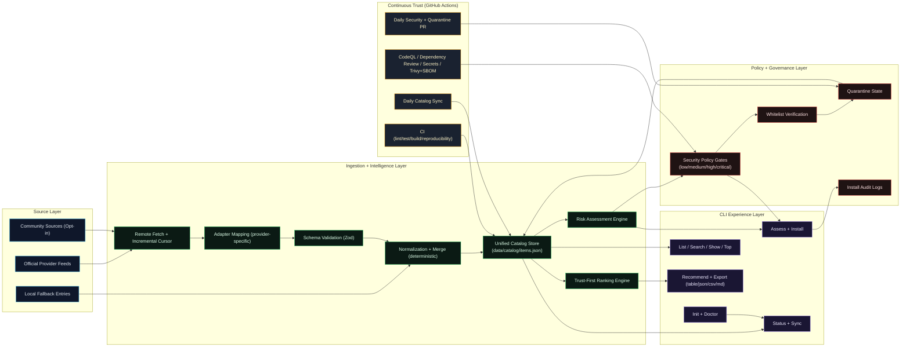
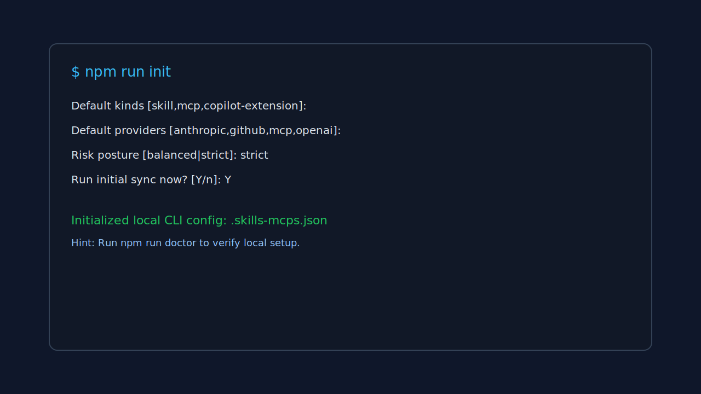
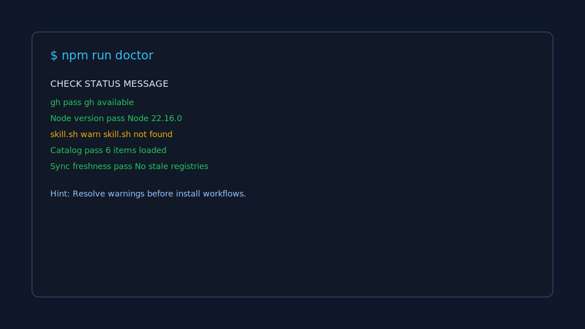
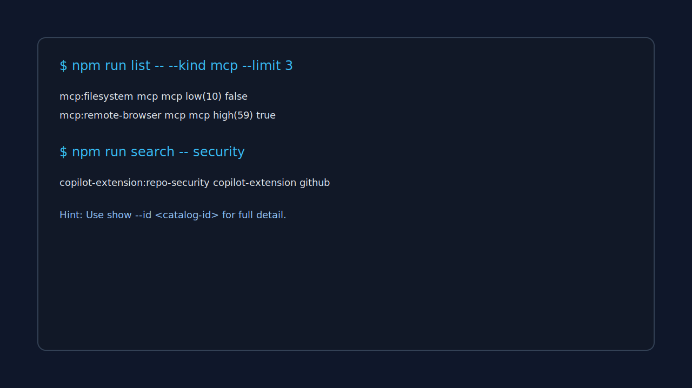
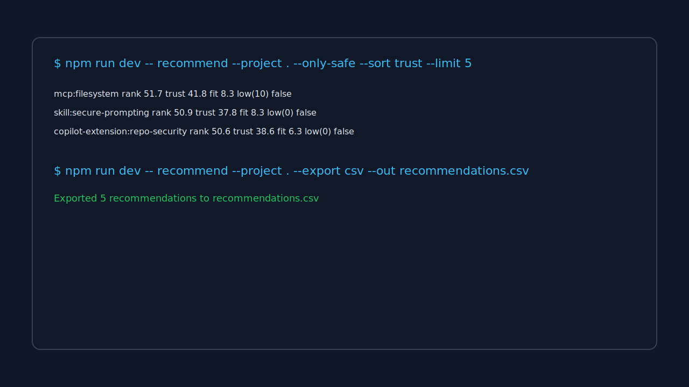
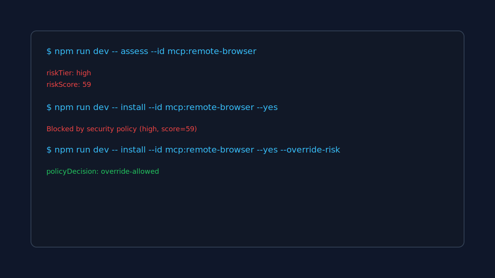
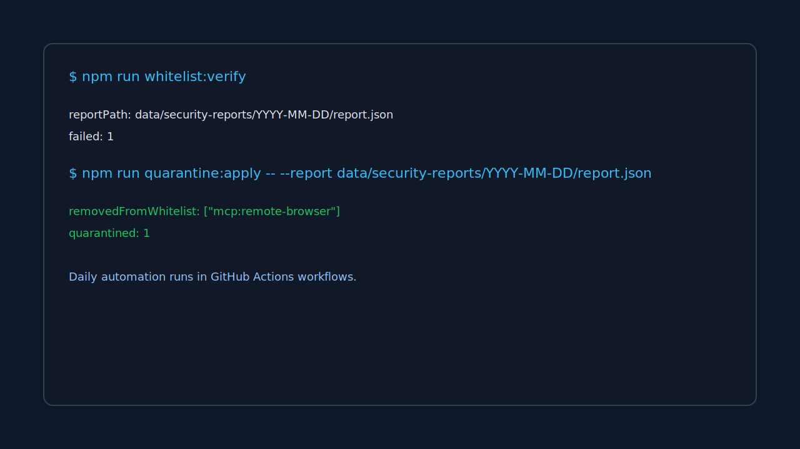

<h1 align="center">Skills + MCP + Plugin Security Intelligence Framework</h1>

<p align="center">
  <a href="https://github.com/amitrintzler/skills-and-mcps/actions/workflows/ci.yml"></a>
  <a href="https://github.com/amitrintzler/skills-and-mcps/actions/workflows/daily-security.yml"></a>
  <a href="https://github.com/amitrintzler/skills-and-mcps/actions/workflows/security-codeql.yml"></a>
  <a href="https://github.com/amitrintzler/skills-and-mcps/actions/workflows/catalog-sync.yml"></a>
  <a href="https://github.com/amitrintzler/skills-and-mcps/actions/workflows/security-dependency-review.yml"></a>
  <a href="https://nodejs.org/">=18.17" src="https://img.shields.io/badge/node-%3E%3D18.17-339933?logo=node.js&logoColor=white" /></a>
</p>

<p align="center">
  <sub>
    Gatekeeping checks tracked as pass/fail: <strong>CI</strong>, <strong>Daily Security</strong>, and <strong>Security / CodeQL</strong>.
    Catalog Sync and Dependency Review are still enabled and linked above.
  </sub>
</p>

<p align="center">
  A production-grade CLI framework to discover, rank, validate, and safely install <strong>Skills</strong>,
  <strong>MCP servers</strong>, <strong>Claude plugins</strong>, and <strong>Copilot extensions</strong>.
</p>

<p align="center">
  Live workflow runs and health details are available in the
  <a href="https://github.com/amitrintzler/skills-and-mcps/actions">GitHub Actions dashboard</a>.
</p>

<p align="center">
  <a href="#quick-start">Quick Start</a> •
  <a href="#how-to-use-this-cli">How To Use</a> •
  <a href="#video-walkthrough">Video Walkthrough</a> •
  <a href="#full-cli-capability-map">CLI Map</a> •
  <a href="#end-to-end-use-cases-with-screenshots">Use Cases</a> •
  <a href="#full-remotion-walkthrough-video">Video Production</a> •
  <a href="#ci-and-security-gates">Security</a>
</p>

---

## Why this framework

| Capability | Outcome |
| --- | --- |
| Unified Catalog | One normalized inventory across all supported ecosystems |
| Trust-First Ranking | Better defaults using fit + trust - risk penalties |
| Policy-Gated Installs | High-risk items blocked by default |
| Continuous Verification | Daily whitelist validation and quarantine automation |
| Rich CLI UX | Guided onboarding, diagnostics, discovery, and export |
| CI Security Controls | CodeQL, dependency review, secrets scan, SBOM + Trivy |

## Visual architecture



---

## Quick Start

```bash
npm install
npm run init
npm run doctor
npm run sync
npm run top -- --limit 5
```

For current project recommendations:

```bash
npm run dev -- recommend --project . --only-safe --sort trust --limit 10
```

## How To Use This CLI

If you want the simplest flow for any project:

```bash
# 1) Install and run guided setup
npm install
npm run init

# 2) Validate your environment
npm run doctor

# 3) Sync latest catalog data
npm run sync

# 4) Discover best options for your current repo
npm run top -- --project . --limit 5

# 5) Inspect and install safely
npm run show -- --id mcp:filesystem
npm run dev -- assess --id mcp:filesystem
npm run dev -- install --id mcp:filesystem --yes
```

Recommended daily usage:

```bash
npm run sync
npm run dev -- recommend --project . --only-safe --sort trust --limit 10
```

## Video Walkthrough

Direct video link:
- https://raw.githubusercontent.com/amitrintzler/skills-and-mcps/main/out/framework-walkthrough.mp4

<video controls width="100%" preload="metadata" src="https://raw.githubusercontent.com/amitrintzler/skills-and-mcps/main/out/framework-walkthrough.mp4">
  Your browser does not support embedded video playback.
</video>

If the player does not render in your viewer, use the direct link above.

---

## Full CLI Capability Map

### Core operations
- `npm run about`
- `npm run status [-- --verbose]`
- `npm run sync [-- --kind skill,mcp,claude-plugin,copilot-extension] [-- --dry-run]`

### Guided setup and diagnostics
- `npm run init [-- --project .]`
- `npm run doctor [-- --project .]`

### Catalog discovery and inspection
- `npm run list -- --kind mcp --limit 10`
- `npm run search -- security`
- `npm run show -- --id mcp:filesystem`
- `npm run top -- --project . --limit 5`

### Recommendation and export
- `npm run dev -- recommend --project . --format table`
- `npm run dev -- recommend --project . --only-safe --sort trust --limit 10`
- `npm run dev -- recommend --project . --export csv --out recommendations.csv`
- `npm run dev -- recommend --project . --export md --out recommendations.md`

### Risk and installation controls
- `npm run dev -- assess --id mcp:remote-browser`
- `npm run dev -- install --id mcp:filesystem --yes`
- `npm run dev -- install --id mcp:remote-browser --yes --override-risk`

### Security operations
- `npm run whitelist:verify`
- `npm run quarantine:apply -- --report data/security-reports/YYYY-MM-DD/report.json`

---

## End-to-End Use Cases (With Screenshots)

### 1) First-time onboarding for any project
Command:
```bash
npm run init
```



### 2) Validate environment readiness
Command:
```bash
npm run doctor
```



### 3) Browse and search catalog quickly
Commands:
```bash
npm run list -- --kind mcp --limit 3
npm run search -- security
npm run show -- --id copilot-extension:repo-security
```



### 4) Generate safe recommendations and export
Commands:
```bash
npm run dev -- recommend --project . --only-safe --sort trust --limit 5
npm run dev -- recommend --project . --export csv --out recommendations.csv
```



### 5) Enforce risk policy before install
Commands:
```bash
npm run dev -- assess --id mcp:remote-browser
npm run dev -- install --id mcp:remote-browser --yes
npm run dev -- install --id mcp:remote-browser --yes --override-risk
```



### 6) Continuous trust operations (verify + quarantine)
Commands:
```bash
npm run whitelist:verify
npm run quarantine:apply -- --report data/security-reports/YYYY-MM-DD/report.json
```



---

## Full Remotion Walkthrough Video

The full walkthrough composition is implemented and ready to render:
- `src/commands/ExplainerVideo.tsx`
- `src/video/Root.tsx`
- `src/video/index.ts`

### Scene coverage
1. Intro and framework scope
2. Init wizard onboarding
3. Doctor diagnostics
4. Sync dry-run and sync
5. List/search/show discovery
6. Recommendation visualization
7. Export flows (CSV/Markdown)
8. Assess and install policy gating
9. Whitelist/quarantine security operations
10. CI and security scan coverage
11. Final operational CTA

### Preview locally
```bash
npm run video:preview
```

### Render full walkthrough
```bash
npm run video:render
```

Output target:
- `out/framework-walkthrough.mp4`

If render fails, check:
- Remotion dependency versions are aligned.
- Headless Chrome download/availability is allowed on your machine/network.

### Embedded video block

Direct link:
- https://raw.githubusercontent.com/amitrintzler/skills-and-mcps/main/out/framework-walkthrough.mp4

<video controls width="100%" src="https://raw.githubusercontent.com/amitrintzler/skills-and-mcps/main/out/framework-walkthrough.mp4">
  Your browser does not support embedded video playback.
</video>

---

## CI and Security Gates

### Workflows
- `.github/workflows/ci.yml`
- `.github/workflows/security-codeql.yml`
- `.github/workflows/security-dependency-review.yml`
- `.github/workflows/security-secrets.yml`
- `.github/workflows/security-sbom-trivy.yml`
- `.github/workflows/daily-security.yml`
- `.github/workflows/catalog-sync.yml`

### Security gate policy

| Check | Scope | Enforcement |
| --- | --- | --- |
| CodeQL | JS/TS code scanning | Blocking |
| Dependency Review | PR dependency changes | Blocking on High/Critical |
| Secrets (gitleaks) | Repository secret leakage | Blocking |
| Trivy SCA | Filesystem vulnerability scan | Blocking on High/Critical |
| Whitelist Verify | Catalog/policy alignment | Blocking in CI |

### Risk tiers

| Tier | Score | Default install policy |
| --- | --- | --- |
| low | 0-24 | allow |
| medium | 25-49 | allow with warning |
| high | 50-74 | block |
| critical | 75-100 | block |

Use `--override-risk` only for explicit risk acceptance.

---

## Configuration Reference

| File | Purpose |
| --- | --- |
| `config/registries.json` | Source registries and adapter mapping |
| `config/providers.json` | Provider policy (enabled, official-only, auth env, polling) |
| `config/security-policy.json` | Scoring weights and install gates |
| `config/ranking-policy.json` | Ranking weights/penalties/tiebreaks |
| `.skills-mcps.json` | Optional local project defaults from `init` |

Remote registry fields:
- `remote.url`
- `remote.format`
- `remote.entryPath`
- `remote.supportsUpdatedSince`
- `remote.updatedSinceParam`
- `remote.pagination`
- `remote.authEnv`
- `remote.fallbackToLocal`

---

## Data Contracts

Primary runtime contracts validated with Zod:
- `CatalogItem`
- `RiskAssessment`
- `Recommendation`
- `InstallAudit`

---

## Backward Compatibility

Legacy aliases remain supported:
- `ingest` -> `sync`
- `validate` -> `whitelist verify`

---

## Security and Operations Docs
- `docs/security/threat-model.md`
- `docs/security/scoring.md`
- `docs/ci/daily-quarantine.md`
