# Toolkit Architecture

Toolkit is organized as a layered pipeline that ingests catalog data, normalizes and ranks items, then applies policy controls before installation.

## Visual Architecture



Mermaid source: `assets/visual-architecture.mmd`

Regenerate the SVG:

```bash
npx -y @mermaid-js/mermaid-cli -i assets/visual-architecture.mmd -o assets/visual-architecture.svg -b transparent
```

## Layer Breakdown

### Source Layer
- Official provider feeds
- Community sources (optional)
- Local fallback entries

### Ingestion + Intelligence Layer
- Remote fetch with incremental cursor support
- Provider adapter mapping
- Zod schema validation
- Deterministic normalization/merge
- Unified catalog store (`data/catalog/items.json`)
- Trust-first ranking and risk assessment engines

### Policy + Governance Layer
- Security policy gates by risk tier
- Whitelist verification
- Quarantine state management
- Install audit logs

### CLI Experience Layer
- Setup and diagnostics (`init`, `doctor`)
- Discovery (`list`, `search`, `show`, `top`)
- Recommendation/export (`recommend`)
- Risk and install controls (`assess`, `install:item`)
- Health/sync (`status`, `sync`)

### Continuous Trust (GitHub Actions)
- CI validation
- Security scans (CodeQL, dependency review, secrets, SBOM/Trivy)
- Daily quarantine automation
- Daily catalog sync

## End-to-End Flow

1. Sync pulls and merges source registries.
2. Validation enforces data contracts via Zod.
3. Ranking and risk scoring compute candidate quality.
4. Project scan provides context-aware fit signals.
5. Recommendation returns policy-filtered candidates.
6. Assess validates install risk for a selected ID.
7. Install writes audit logs and respects gate policy.
8. Scheduled workflows verify whitelist and quarantine violations.

## Related Docs

- CLI commands: [`cli-reference.md`](cli-reference.md)
- Security model: [`security/README.md`](security/README.md)
- Daily quarantine workflow: [`ci/daily-quarantine.md`](ci/daily-quarantine.md)
