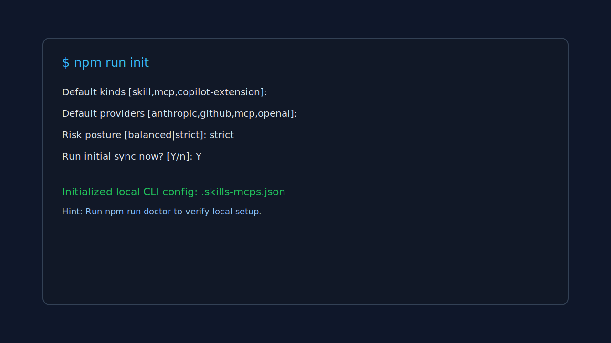
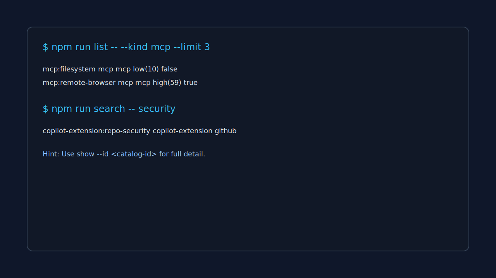
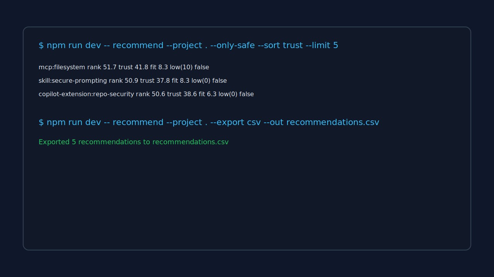
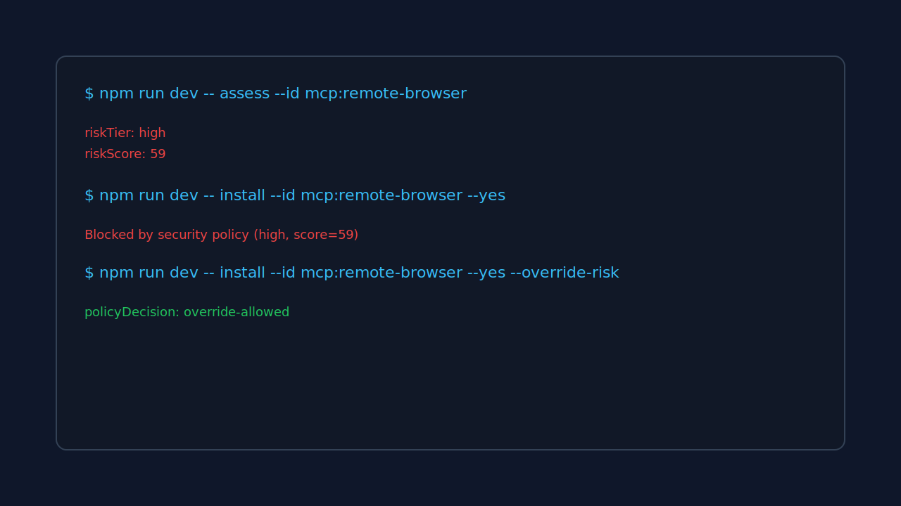
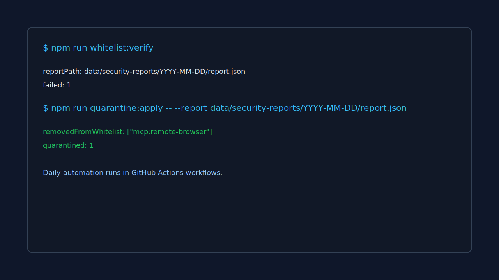

# End-to-End Use Cases

## 1) First-Time Onboarding

Command:

```bash
npm run init
```



## 2) Validate Environment Readiness

Command:

```bash
npm run doctor
```


## 3) Browse and Search Catalog

Commands:

```bash
npm run list -- --kind mcp --limit 3
npm run search -- security
npm run show -- --id copilot-extension:repo-security
```



## 4) Generate Safe Recommendations and Export

Commands:

```bash
npm run recommend -- --project . --only-safe --sort trust --limit 5
npm run recommend -- --project . --export csv --out recommendations.csv
```



## 5) Enforce Risk Policy Before Install

Commands:

```bash
npm run assess -- --id mcp:remote-browser
npm run install:item -- --id mcp:remote-browser --yes
npm run install:item -- --id mcp:remote-browser --yes --override-risk
```



## 6) Run Continuous Trust Operations

Commands:

```bash
npm run whitelist:verify
npm run quarantine:apply -- --report data/security-reports/YYYY-MM-DD/report.json
```


